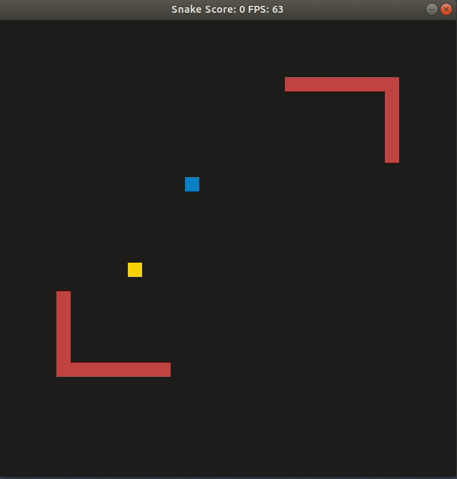

# CPPND: Capstone Snake Game Project (Option 2)

This is a repo for the Capstone project in the [Udacity C++ Nanodegree Program](https://www.udacity.com/course/c-plus-plus-nanodegree--nd213). The starter code for this repo was inspired by [this](https://codereview.stackexchange.com/questions/212296/snake-game-in-c-with-sdl) excellent StackOverflow post and set of responses.



## Description

A game Snake, which extends provided basic version. Extended version enables a user adding maps with obstacles. Maps can be created and saved in the directory `/maps` which is located in the root of the project directory. Maps should be defined with `0 - free pixel` and `1 - obstacle pixel` in a form of `32 rows x 32 columns` sized matrix. Examples are provided. 

## Expected Behaviour or Output of the Program

At the beginning of the game, in case if maps are available, a user is prompted to select a map, by providing an `int` input which corresponds to the map `id` in the list. The program echos the name of the selected map and starts a SDL Library GUI. The Goal of the game is to gain a score by means of aiming the snake towards the food cubes, while avoiding collision of the snake with itself or the obstacles on the map.

## Rubric Cross-Reference
* **Loops, Functions, I/O**
  * A variety of control structures are used in the project. The project code is clearly organized into functions **(general)**
  * The project reads data from an external file or writes data to a file as part of the necessary operation of the program **(map.cpp L:12)**
  * The project accepts input from a user as part of the necessary operation of the program **(utility.cpp L:36)**
* **Object Oriented Programming**
  * The project code is organized into classes with class attributes to hold the data, and class methods to perform tasks **(map.h L:10)**
  * All class data members are explicitly specified as public, protected, or private **(object.h L:8)**
  * All class members that are set to argument values are initialized through member initialization lists **(object.h L:11)**
  * All class member functions document their effects, either through function names, comments, or formal documentation. Member functions do not change program state in undocumented ways **(general)**
  * Appropriate data and functions are grouped into classes. Member data that is subject to an invariant is hidden from the user. State is accessed via member functions **(map.h L:14)**
  * Inheritance hierarchies are logical. Composition is used instead of inheritance when appropriate. Abstract classes are composed of pure virtual functions. Override functions are specified **(object.h L:13, game.h L:22)**
  * One member function in an inherited class overrides a virtual base class member function **(snake.h L:20)**


## Dependencies for Running Locally
* cmake >= 3.7
  * All OSes: [click here for installation instructions](https://cmake.org/install/)
* make >= 4.1 (Linux, Mac), 3.81 (Windows)
  * Linux: make is installed by default on most Linux distros
  * Mac: [install Xcode command line tools to get make](https://developer.apple.com/xcode/features/)
  * Windows: [Click here for installation instructions](http://gnuwin32.sourceforge.net/packages/make.htm)
* SDL2 >= 2.0
  * All installation instructions can be found [here](https://wiki.libsdl.org/Installation)
  * Note that for Linux, an `apt` or `apt-get` installation is preferred to building from source.
* gcc/g++ >= 9.2.1
  * Linux: gcc / g++

    ```
    sudo add-apt-repository ppa:ubuntu-toolchain-r/test
    sudo apt update
    sudo apt install gcc-9
    ```
    
    if there earlier versions of compiler are installed, default version has to be defined
    
    first erase the current `update-alternatives` setup for `gcc` and `g++`

    ```
    sudo update-alternatives --remove-all gcc 
    sudo update-alternatives --remove-all g++
    ```

    install alternatives (ex. for setup for versions 8 and 9)

    ```
    sudo update-alternatives --install /usr/bin/gcc gcc /usr/bin/gcc-8 10
    sudo update-alternatives --install /usr/bin/gcc gcc /usr/bin/gcc-9 20

    sudo update-alternatives --install /usr/bin/g++ g++ /usr/bin/g++-8 10
    sudo update-alternatives --install /usr/bin/g++ g++ /usr/bin/g++-9 20

    sudo update-alternatives --install /usr/bin/cc cc /usr/bin/gcc 30
    sudo update-alternatives --set cc /usr/bin/gcc

    sudo update-alternatives --install /usr/bin/c++ c++ /usr/bin/g++ 30
    sudo update-alternatives --set c++ /usr/bin/g++
    ```

    configure alternatives

    ```
    sudo update-alternatives --config gcc
    sudo update-alternatives --config g++
    ```

    check default version

    ```
    gcc --version
    g++ --version
    ```

  * Mac: same deal as make - [install Xcode command line tools](https://developer.apple.com/xcode/features/)
  * Windows: recommend using [MinGW](http://www.mingw.org/)

## Basic Build Instructions

1. Clone this repo.
2. Make a build directory in the top level directory: `mkdir build && cd build`
3. Compile: `cmake .. && make`
4. Run it: `./SnakeGame`.